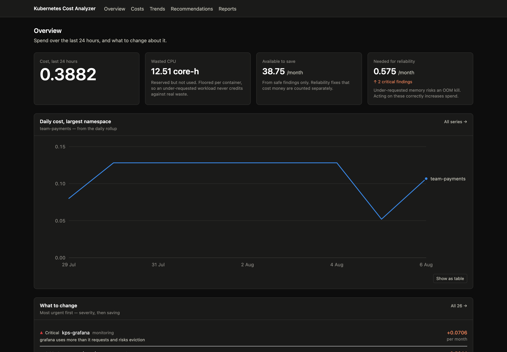
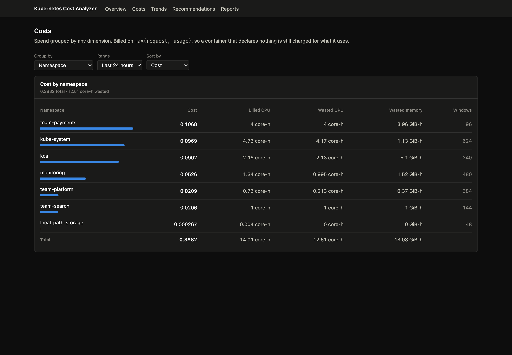
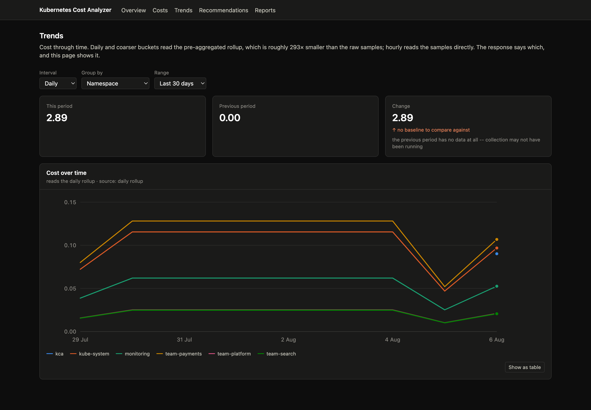
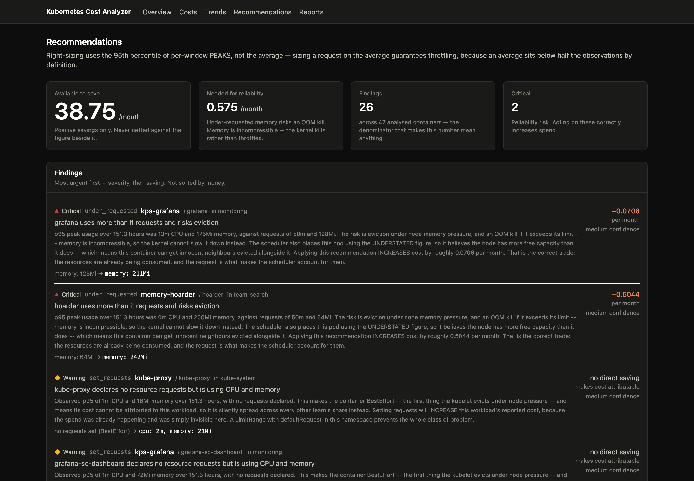
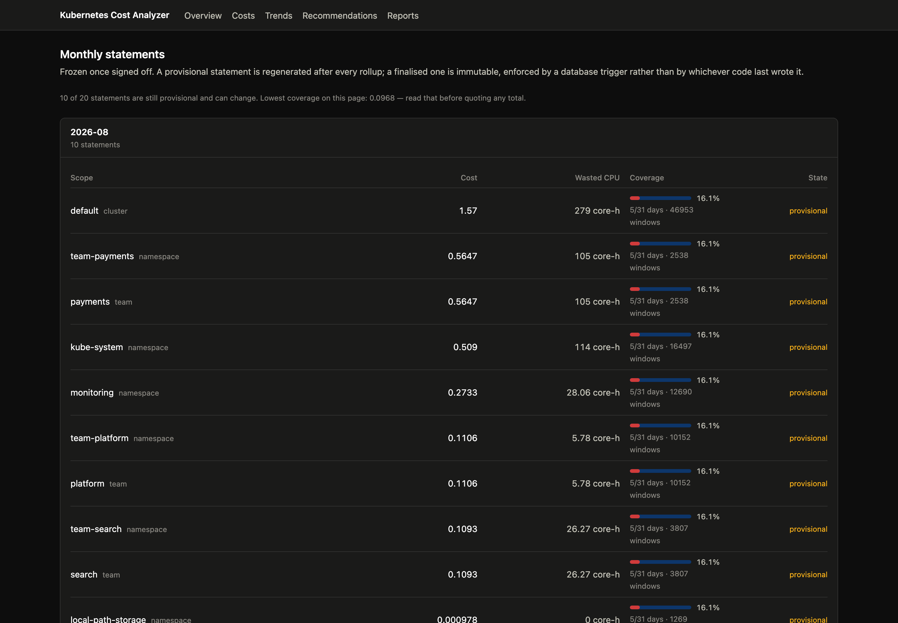

# Kubernetes Cost Analyzer

[](https://github.com/Pheonix2507/kubernetes-cost-analyzer/actions/workflows/ci.yml)
[](go.mod)
[](LICENSE)

Attributes Kubernetes spend to the teams, namespaces and workloads that cause it, and recommends
what to change. Go collector and API, PostgreSQL star schema, Next.js dashboard, Helm chart,
Prometheus alerts, all reproducible from this repository with one command.



```bash
make reset      # kind cluster, monitoring stack, fixture workloads, Postgres, schema
make run-api    # :8080
make run-collector
cd web && pnpm dev   # :3000
```

## What it does

| | |
|---|---|
| **Measures** | Every container's requests and usage on aligned 5-minute windows, from Prometheus and the Kubernetes API |
| **Prices** | Nodes by instance type, spot-aware and region-aware, split across CPU and memory with exact decimal arithmetic |
| **Attributes** | Cost and waste to namespace, team, cost centre, environment, workload, node, instance type |
| **Recommends** | p95-based right-sizing with evidence gates, severity, and savings that are allowed to be negative |
| **Keeps** | A daily rollup compressing history 246-293x (measured, varies with the data), and immutable monthly statements frozen by a database trigger |

## Five decisions worth reading

Judgement is the interesting part of this repository, so here are the load-bearing calls with links
to the code that makes them.

1. **[Waste is floored per row, inside the sum](#the-core-idea-is-one-subtraction).**
   `GREATEST(sum(req) - sum(used), 0)` reads as equivalent and is not. On real data `kube-system`
   reported **0 GiB-hours** of memory waste while holding 50, and the more under-requested a team's
   workloads were, the more efficient it looked.
2. **[Not every aggregate rolls up](#the-rule-that-decided-the-whole-design-not-every-aggregate-rolls-up).**
   Sums, minima, maxima and counts survive a daily rollup; averages survive only as sum divided by
   count; **percentiles do not survive at all**. That one fact decided which questions the 246x
   cheaper table is allowed to answer, and which must still read raw facts.
3. **[Readiness fails closed on an unmigrated schema](#the-readiness-probe-that-stalls-a-rollout-on-purpose).**
   Probing `SELECT 1` tests the process; this tests the contract. An unmigrated database now stalls
   a rollout while the old pod keeps serving, instead of letting Kubernetes kill a healthy pod and
   replace it with one that answers 500s while showing green.
4. **[`go test` exits 0 on a skip](#the-trap-a-green-build-that-tested-nothing).**
   A CI job that lost its database printed skip lines nobody reads and reported success with the
   entire persistence layer untested. `KCA_REQUIRE_DB` turns that into a failure, and CI runs the
   suite with the database deliberately hidden to prove the guard still bites.
5. **[Money is a string all the way to the browser](#money-is-a-string-and-the-compiler-enforces-it).**
   `numeric(20,10)` in Postgres, `decimal.Decimal` in Go, a branded `Money` type in TypeScript that
   makes `Number(m)` unreachable. Float arithmetic on a figure someone reconciles against an invoice
   is a credibility problem, not a rounding curiosity.

## What this deliberately does not do

Scope honesty, because the numbers should be believed only as far as they are true.

- **Compute only.** Nodes are priced by instance type and split across CPU and memory. Storage, load
  balancers and egress are not modelled, and on a real bill those are commonly 30-50% of spend.
- **List prices only.** The rate catalogue has no reserved instances, savings plans, committed use
  discounts or enterprise agreements, so computed cost runs above what an account actually pays.
- **One cluster.** The schema, API and collector are multi-cluster aware and a central ingest
  boundary is not built yet, so today one collector serves one cluster.
- **Not deployed anywhere.** The Helm chart installs into kind and is verified by 15 assertions
  against a running release; there is no registry, ingress or managed database story.

The gap between "this computes a number" and "finance trusts this number" is mostly the first two
items, and pretending otherwise would be the least interesting thing this repository could do.

## Screenshots

| Costs | Trends |
|---|---|
|  |  |

| Recommendations | Monthly reports |
|---|---|
|  |  |

---

## The core idea is one subtraction

Kubernetes bills you for what you **reserve**
(resource requests), not for what you **use** — the scheduler holds a request against a
node whether or not the container ever touches it. The gap between the two is waste, and
in most clusters that has never been measured it is the majority of the bill.

```
waste = max(requested - used, 0)
```

Everything else in this repository is data collection, aggregation and presentation on
top of that.

The `max(..., 0)` is the part that bites. It has to be applied **per row, inside the sum** — not to
the aggregate. `GREATEST(sum(requested) - sum(used), 0)` reads as equivalent and is not: the
cancellation happens inside the two sums, before the subtraction, so an under-requested container
issues a *credit* against genuine waste elsewhere in the same group. This repo shipped that version.
Measured on real data, `kube-system` reported **0 GiB-hours** of memory waste while actually holding
50, and `team-search` was understated by 126%. The more under-requested a team's workloads were, the
more efficient it looked.

## Status: Phase 10 complete — it can be installed

The collector produces cost data, the API serves it, the recommendation engine says what to change, a
nightly rollup makes history cheap (**292.7x compression, measured**), a Next.js dashboard reads all of
it with the API key held server-side, both binaries expose their own metrics with alerts that fire
on the failures that actually destroy data, and a Helm chart installs the whole thing into a cluster
with CI that refuses to go green on an untested database.

What works today:

- One command rebuilds the entire local environment from files in this repo
- A 3-node kind cluster whose nodes carry fake cloud instance types, so pricing has
  something real to key on
- kube-prometheus-stack and metrics-server, trimmed to fit an 8 GiB Docker VM
- Seven fixture workloads engineered so every future detection rule has both a positive
  and a negative case
- client-go shared informers holding a live cache of nodes, namespaces, pods and
  ReplicaSets, with pod ownership resolved through to the owning Deployment
- Effective pod requests computed the way the scheduler computes them — init containers
  as a max, sidecars additive, pod overhead included
- A read-only ClusterRole, verified by assertion that every write and secret read is
  denied
- Two Go binaries with config validation, structured logging, dependency injection,
  liveness/readiness split and graceful shutdown
- A partitioned star-schema in Postgres: normalised dimensions, an immutable
  container-grain fact table, monthly RANGE partitions, and idempotent upserts
- Exact decimal money end to end (`decimal.Decimal` ↔ `numeric(20,10)`), never float
- A pricing engine: a YAML rate catalogue keyed on the same well-known instance-type
  labels a cloud provider sets, spot-aware, region-aware, with explicit provenance on
  every rate
- A cost engine that joins topology, usage and rates: a bounded worker pool over
  namespaces, best-effort per-namespace failure isolation, `max(request, usage)` billing,
  and aligned windows that make re-collection idempotent
- Per-window peak collection (`max_over_time`) alongside averages, because the two answer
  different questions: an average for cost, p95-of-peaks for right-sizing
- A recommendation engine with an evidence gate, headroom on every proposal, and savings
  that are allowed to be negative when the correct advice costs money
- A daily rollup at 292.7x compression, written by a batch job that is idempotent, backfillable,
  and mutually excluded by a Postgres advisory lock
- Immutable monthly statements with honest coverage metadata, frozen by database trigger
- Three non-root, shell-less container images
- A Next.js dashboard: five pages, server-rendered, with the API credential held by a
  server-side proxy and TypeScript types generated from the OpenAPI spec
- RED metrics on the API, batch metrics on the collector, freshness gauges read from the
  database, 9 alert rules and a Grafana dashboard — all as code, all verified by a script
- A Helm chart that installs all four components in their correct workload forms, refuses to
  render without a cluster name or an image tag, and refuses to run two collectors
- A readiness probe that checks the schema, so an unmigrated database stalls a rollout
  instead of serving 500s from a pod marked Ready
- GitHub Actions across five parallel jobs, including a job that fails when the database
  tests would silently skip and a step that verifies that guard still works

### Endpoints

| Method | Path | Returns |
|---|---|---|
| GET | `/healthz` | liveness — checks nothing, by design |
| GET | `/readyz` | readiness — per-dependency detail for Postgres and the informer cache |
| GET | `/version` | the build actually running |
| GET | `/api/v1/nodes` | capacity, allocatable, instance type, zone, spot vs on-demand, **and rates** |
| GET | `/api/v1/namespaces` | cost-allocation dimensions (team, cost-centre, environment) |
| GET | `/api/v1/pods` | requests, limits, QoS class, resolved workload. `?namespace=` filters |
| GET | `/api/v1/costs/summary` | **aggregated cost** — `?group_by=` any of 10 dimensions, filtered, sorted |
| GET | `/api/v1/allocations` | raw per-container samples, cursor-paginated |
| GET | `/api/v1/recommendations` | **what to change** — right-size, idle, under-requested, set-requests, over-replicated |
| GET | `/api/v1/costs/trend` | cost **through time** from the rollup, with period-over-period comparison |
| GET | `/api/v1/reports/monthly` | frozen monthly statements at cluster, namespace and team scope |

Full contract in [`api/openapi.yaml`](api/openapi.yaml), kept honest by a test asserting its enums
match the allow-lists the code enforces.

```bash
curl -H "Authorization: Bearer $KEY" \
  'localhost:8080/api/v1/costs/summary?group_by=workload&sort=wasted_cpu_core_hours'

curl -H "Authorization: Bearer $KEY" localhost:8080/api/v1/recommendations

curl -H "Authorization: Bearer $KEY" \
  'localhost:8080/api/v1/costs/trend?interval=day&group_by=team&compare=previous_period'
```

## Prerequisites

`go` 1.26+, `docker`, `kind`, `kubectl`, `helm`, `golangci-lint`. A Docker VM with at
least 6 CPUs and 8 GiB.

## Quick start

```bash
make env      # create .env from .env.example
make up       # kind cluster + monitoring + fixtures + Postgres
make run-api  # start the API on :8080
```

Then:

```bash
curl localhost:8080/healthz   # liveness
curl localhost:8080/readyz    # readiness, with per-dependency detail
curl localhost:8080/version   # which build is running
```

| Service | URL | Notes |
|---|---|---|
| Grafana | http://localhost:13000 | `admin` / `prom-operator` |
| Prometheus | http://localhost:19090 | |
| Postgres | `localhost:55432` | db `kca_dev`, user `kca` |

Ports are deliberately unusual. Grafana avoids 3000 (the Next.js dev server takes it in
Phase 8), Prometheus avoids 9090, and Postgres avoids 5432 so a Homebrew Postgres on the
host is never touched.

`make help` lists every target.

## Architecture

```
                    ┌──────────────────────────────────────────┐
                    │  Next.js  (Phase 8)                      │
                    └───────────────────┬──────────────────────┘
                                        │ REST /api/v1
                    ┌───────────────────▼──────────────────────┐
                    │  cmd/api                                 │
                    │  router → middleware → handlers          │
                    └──────┬───────────────────────────────────┘
                           │ repositories (Phase 2)
                    ┌──────▼───────────┐
                    │  PostgreSQL      │  facts + rollups
                    └──────▲───────────┘
                           │ writes
                    ┌──────┴───────────────────────────────────┐
                    │  cmd/collector                           │
                    │  scheduler → worker pool → cost engine   │
                    └───┬──────────────────────────┬───────────┘
         informers (watch)                          │ PromQL range queries
                    ┌───▼──────────┐          ┌────▼─────────────┐
                    │ K8s API      │          │ Prometheus       │
                    │ pods/nodes   │          │ cAdvisor + KSM   │
                    └──────────────┘          └──────────────────┘
```

Two binaries, deliberately. The API scales with user traffic; the collector must **not**
— two collectors would write every cost sample twice and the numbers would be silently
wrong.

**Why Postgres as well as Prometheus.** Prometheus holds the raw time series but cannot
do the joins, ownership rollups and monthly reporting that cost allocation needs, and its
retention is finite. Postgres holds the allocation facts and the aggregates.

### Layout

```
web/             the Next.js dashboard — see "The dashboard" below
  src/app        App Router pages; api/kca is the credential-holding proxy
  src/lib        typed client, generated schema, Money type, query keys, palette
  src/components figures (tile/meter/bar/badge), the SVG line chart
cmd/api          HTTP API — wiring only, no logic
cmd/collector    the collection loop: aligned windows, cost engine, writer
cmd/rollup       the batch job: nightly rollup, backfill, monthly statements
internal/
  buildinfo      version/commit injected at link time
  config         env loading + validation, stdlib only
  logging        log/slog setup and request-scoped loggers
  health         Checker interface + concurrent readiness aggregator
  domain         the vocabulary all three layers share; stdlib imports only
  kube           client-go: dual-mode client, shared informers, pure translation
  pricing        rate catalogue, the CPU/memory split, pure cost arithmetic
  prom           PromQL usage queries (the container!="" filter matters -- see below)
  costing        the join: topology x usage x rates -> cost, with a bounded worker pool
  metrics        our own instrumentation: RED, batch metrics, freshness gauges
  recommend      the rule engine: evidence gates, p95 right-sizing, severity by failure mode
  rollup         batch orchestration: transaction boundaries, failure isolation, backfill
  httpapi        server, router, JSON responses, handlers for every endpoint
    middleware   request ID, access log, panic recovery, API-key auth, rate limiting
  store/postgres pgx pool, Querier seam, dimension + fact + rollup + statement repositories
migrations       numbered SQL, applied with golang-migrate
deploy/
  kind           cluster definition
  monitoring     Helm values, scrape config, alert rules, Grafana dashboard, verify.sh
  demo-workloads fixture workloads
  rbac           read-only ClusterRole + a script that proves it
  pricing        the rate catalogue (edit this; the shipped prices are indicative)
```

## The fixtures are the test data

`deploy/demo-workloads/` contains seven workloads chosen so each detection rule can be
proven right *and* proven not to over-fire. Every value was set by measuring with
`kubectl top`, not guessed.

| Workload | Namespace | Expected verdict |
|---|---|---|
| `over-provisioned-api` | team-payments | Flag — reserves 500m/512Mi, uses ~2m/5Mi |
| `right-sized-worker` | team-platform | **Do not flag** — the control case, ~70% utilised |
| `memory-hoarder` | team-search | Flag — uses 3x its memory request (a *reliability* risk) |
| `no-requests-at-all` | team-search | Flag — consumes real resources, bills as zero |
| `idle-service` | team-search | Flag — zero CPU; recommend **delete**, not resize |
| `over-replicated` | team-platform | **Not flagged, and that is correct** — see below |
| `abandoned-migration-data` | team-payments | Not yet detected — needs a PVC lister |

`right-sized-worker` matters most. Every other fixture is wasteful, so a rule that
returns "everything is wasteful" — or ignores its input entirely — would look correct on
all of them. False positives are what kills adoption of a tool like this.

`no-requests-at-all` is a trap for our own engine: cost computed from requests alone
reports it as free, and its real cost gets smeared silently across every other team. This
is why cost must be billed on `max(request, usage)`.

`over-replicated` is the fixture that did not work out, and it is more useful stated plainly than
quietly re-tuned. It was calibrated until each pod was genuinely well utilised (11m against a 15m
request, 73%) specifically so no per-container rule would fire — the premise being "six replicas
where two would do, and per-pod analysis finds nothing". But nothing else can find it either: if
every pod is 73% utilised, removing replicas overloads the survivors. Whether six busy pods could be
replaced by two *bigger* ones is a question about **traffic**, and no CPU or memory metric answers
it. The rule detects six *idle* replicas, which is the common form of the problem; the harder form
needs request-rate data and is honestly out of reach for now.

The fake instance-type labels on the kind nodes (`m5.large`, `m5.xlarge`, one spot node,
two zones) use the same well-known label keys a cloud provider sets, so the pricing engine
will work unchanged against a real EKS cluster.

## The data model

A star schema: normalised dimensions for mutable current state, one denormalised,
immutable fact table for history.

```
   nodes ──┐
namespaces ─┤
 workloads ─┼──►  container_allocations   (one row per container per window)
     pods ──┘         partitioned by month on window_start
```

Three decisions drive it, and each exists to prevent a specific way of being wrong:

**Container grain, not pod grain.** A pod with a bloated sidecar and a well-sized app
container averages out to "fine" at pod grain. That is the commonest real waste pattern on
any service-mesh cluster, and it is invisible unless the grain is per container. Pod and
workload figures are `SUM`s over this; the reverse is not recoverable.

**Attribution is denormalised onto the fact row.** `team`, `cost_centre`, `instance_type`
and the rates used are copied onto each row at collection time. If `team` were joined from
`namespaces`, relabelling a namespace would silently rewrite every historical report — last
month's reconciled figure would change after the fact. Normalise mutable state, denormalise
immutable history.

**Money is `numeric(20,10)` and `decimal.Decimal`, never float.** `float64` cannot represent
`0.1`, and the error compounds under `SUM` across millions of rows in a number someone
reconciles against a cloud invoice. Worse, the drift depends on summation order, which the
planner may change between runs — so the report disagrees with itself.

Two properties the schema enforces rather than trusts:

- **Idempotency.** The primary key `(window_start, pod_id, container_name)` plus
  `ON CONFLICT DO UPDATE` means a retried collection window converges instead of
  double-counting. A bare `INSERT` would inflate the bill on every retry.
- **The billing rule.** A `CHECK` constraint asserts the stored billable amount really is
  `max(requested, used)`, so even SQL written outside this repo cannot break it.

## Pricing: the assumption you should know about

An `m5.large` costs **one** number per hour and has **two** resources. Splitting that price
between CPU and memory is an *allocation policy*, not a calculation — there is no objectively
correct answer, and any tool implying otherwise has hidden its assumption somewhere you
cannot see it.

Ours lives in `deploy/pricing/catalogue.yaml`, in the open:

```yaml
split:
  cpu: 0.70      # must sum to 1, or the loader refuses to start
  memory: 0.30
```

```
cpu_per_core_hour = hourly × cpu_share / vcpu_count
mem_per_gib_hour  = hourly × mem_share / memory_gib
```

The invariant that makes this coherent rather than merely plausible: **reserving a whole node
for one hour must cost exactly the node's hourly price**, because the shares sum to 1. That is
tested directly across six instance shapes, including a deliberately indivisible 3-vCPU/7-GiB
one so the rounding is real rather than hidden by convenient arithmetic.

Three details that decide whether the numbers can be trusted:

- **We divide by the catalogue's vCPU count, not the node's reported capacity.** You are
  billed for the instance you rented. This is also why the fake labels on the kind nodes work
  — they report 6 CPU but price as the 2 vCPU an `m5.large` actually has.
- **Every rate carries its provenance** (`catalogue`, `explicit_rates`, `fallback`). A cost
  derived from a guess must never look identical to one derived from a real price, or someone
  will take a fabricated figure to a finance meeting.
- **An unknown instance type is priced from a stated fallback and marked as such — never
  zero.** Zero is the tempting option and the worst one: every pod on that node reports as
  free, the cluster total understates the bill, and because the missing money still has to go
  somewhere in a percentage breakdown, every *other* team appears to consume a larger share
  than it does.

The prices shipped in the catalogue are indicative AWS ap-south-1 list prices and are
approximately wrong for you. Reserved Instances, Savings Plans and Enterprise Agreements move
the effective rate by 40% or more. Replace them with the numbers on your invoice.

## How a cost figure is produced

```
informers ──► what exists, and what each CONTAINER reserved
Prometheus ──► what it actually USED over the window
catalogue ──► what a core-hour and a GiB-hour COST on that node
                        │
                        ▼
        billable = max(requested, used)          <- the whole product
        cost     = billable x window x rate
                        │
                        ▼
              container_allocations
```

Four things this gets right that the obvious implementation does not:

**`container!=""` on every PromQL query.** cAdvisor emits a pod-level aggregate series *and*
one per container. Omit the filter and every pod is counted twice — measured on this cluster:
24.0Mi without it, 11.5Mi with it, a **2.1× overcount**.

**Windows are aligned to the interval, not to `now`.** `[now-5m, now)` means a restart at
09:04:10 records a window overlapping the one recorded at 09:02:37. They share no primary key,
so the fact table cannot deduplicate them and the overlap is billed twice — the bill grows with
every restart. Truncating means every process agrees where boundaries are. Verified: three
collector runs over one window produce 37 rows, not 111.

**Init containers are excluded; sidecars are not.** Kubernetes puts both in
`spec.initContainers`, distinguished only by `restartPolicy: Always`. Read it naively and
either every service-mesh proxy vanishes from the bill, or every migration container is charged
forever for ten seconds of work.

**One namespace failing does not lose the other 39.** `errgroup` cancels its context on the
first error, which is right for all-or-nothing work and catastrophic here. The closures always
return `nil` and record failures separately, so `errgroup` acts purely as a bounded pool.
Partial coverage that *reports its gaps* beats a total blank.

## Recommendations: turning cost into advice

**The statistic must match the question.** Cost is an integral, so it uses the *average* over each
window. Right-sizing is a safety question, so it uses **p95 of the per-window peaks**. Sizing a
request on the average guarantees throttling — an average by definition sits below half the
observations. Two different questions, two different statistics, both collected.

**Every rule passes an evidence gate first.** A minimum window count, a minimum observation *span*,
and peak coverage. The span matters more than the count: a hundred windows over one hour still only
describes that hour, so a batch job that runs on Sundays looks abandoned on a Tuesday. The default
range for this endpoint is **7 days**, not the 24 hours the cost endpoints use, for exactly that
reason.

**CPU and memory fail differently, so severity differs.** CPU is compressible — exceeding a request
means CFS throttling, which is slow. Memory is not — exceeding it means the kernel OOMKills the
container. So an under-requested memory finding is `critical` even though acting on it *increases*
cost, while a large CPU saving is merely `info`.

**Savings are allowed to be negative, and are never netted against positives.** The response reports
`potential_monthly_saving` and `required_monthly_increase` as two separate fields. A single net
figure would let a large right-sizing win cancel out a memory increase someone *must* make, and the
page would read "net saving $30" with the reliability fix invisible inside it.

**Headroom rounds up, always.** `p95 x 1.2` was truncated to an integer, which erased the margin
entirely for p95 values of 1–4 millicores — the band most quiet containers live in. Four of the
first five values got no headroom at all and the proposal landed exactly *on* p95, which by
definition 5% of windows exceed. A safety margin rounded down is not a safety margin.

**Over-replication only applies where the replica count is a field someone can set.** The first live
run advised scaling `kindnet` and `node-exporter` to 2 replicas. Both are DaemonSets: one pod per
node, no `replicas` field, and acting on it would have left a node with no network plugin in exchange
for $1.26 a month. The rule read `count(DISTINCT pod_name) = 3` without asking *why* there were
three. The gate is an **allow-list** of kinds, so an unknown CRD defaults to silence rather than to
confident advice about someone else's resource.

## Observability

`make observability-up` applies it; `make observability-verify` proves it works.

### RED fits the API. It does not fit the collector.

This is the decision the rest follows from. **A dead collector emits no metrics at all**, so
`rate(kca_collector_cycles_total[5m]) == 0` never fires — the series just goes stale, and stale series
are invisible. Alerting on a bad value only works when a process is alive enough to report one.

So the collector's most important metric is a timestamp:

```promql
time() - kca_collector_last_success_timestamp_seconds > 900
```

`time()` keeps advancing whether or not anything is alive, so this fires for a crashed collector, a
wedged one, a crash-looping one and a deleted one alike.

### `retention: 7d` decides the severities

Prometheus keeps 7 days. That single number splits the alerts:

| Failure | Recoverable? | Severity |
|---|---|---|
| Collector stalled | **No** — past 7d the usage samples expire and that cost is unknowable forever | **critical** |
| Rollup stalled | Yes — `make rollup-backfill` rebuilds from facts | warning |
| API 5xx / slow | Yes | warning |
| Half the CPU wasted | It's the finding, not a failure | info |

Exactly one alert pages, and it's the one that destroys data rather than the one that annoys users.
**Severity tracks recoverability, not impact.**

### Cardinality, and a claim I had to withdraw

The route label comes from `r.Pattern` (Go 1.23+) — the pattern the mux *matched*, so the ceiling is
the number of registered routes, bounded by the router itself.

I originally justified that by saying `r.URL.Path` would make every query string a new series. **That's
false**, and a mutation test caught it: `net/http` parses a URL into `Path` and `RawQuery`, so
`r.URL.Path` for `/api/v1/pods?namespace=x` is just `/api/v1/pods`. The test asserting otherwise was
passing for no reason.

The real unbounded sources are:

- **Path parameters.** `/api/v1/pods/{name}` gives one series per pod under `r.URL.Path` — and every
  rollout replaces all of them, so the label set turns over completely while Prometheus holds each dead
  series in memory for hours. This API has no path parameters *yet*, which is exactly why the test
  exists now: the first route that adds one would otherwise be the change that breaks Prometheus.
- **Unmatched paths.** A scanner probing `/wp-admin`, `/.env` and a thousand friends. Labelling those
  by path makes cardinality an **attacker-controlled quantity** — a denial of service against your own
  monitoring, delivered through requests you already reject.

Also deliberate: `status_class` is `2xx`/`4xx`/`5xx`, not the exact code (five values, not forty), and
the duration histogram carries **no** status label — that asymmetry takes it from ~540 series to ~108.

### You cannot scrape a process that has exited

`cmd/rollup` runs, writes, and dies. The canonical answer is a Pushgateway: a whole component whose job
is holding a metric for a dead process.

There's a better answer, and it's better for a reason beyond avoiding a component. **The database
already records what happened** — `max(rolled_up_at)` *is* the last successful rollup. So the API reads
it and exposes it as a gauge.

A Pushgateway reports *"the job said it finished"*. This reports *"the rows are there"*. Those come
apart in exactly the failure a job's own success metric cannot see: a job that exits zero having
written nothing.

### You cannot probe one either

The collector had no HTTP server at all, so instrumenting it would have been pointless — nothing could
scrape it. That's the same problem as its missing liveness probe, so Phase 9 added the listener and
closed a deferral carried since Phase 4. Without one, Kubernetes' only liveness signal is "the process
has not exited", so a collector wedged on a hung query looks healthy forever — and a wedge that never
restarts is worse than a crash, because a crash is visible in the restart count.

### Cost alerts are gated on freshness

A stale cluster reads as **zero cost** — verified: with the collector down 22 hours,
`kca_cost_cluster_hourly` read 0 while nothing was actually free. So every cost alert carries:

```promql
and on() (kca:facts_age_seconds < 900)
```

Without it, one root cause produces five alerts and the on-call engineer has to work out which is the
cause. That's how alert fatigue starts.

### Two bugs found by reading real output

**The API claimed a collector timestamp.** One shared registry meant the API registered the collector's
metrics and never set them, serving `kca_collector_last_success_timestamp_seconds 0` — which is 1970, so
the critical alert would have fired *permanently* from a process that doesn't collect. A metric a
process never writes is not neutral; it's an assertion of zero, and zero is a value alerts act on.
There are now two types, and the compiler enforces the boundary.

**The cost gauge lagged by up to two hours.** It summed the last *complete* clock hour, on the reasoning
that a partial hour sawtooths. True of a truncated-to-now range, false of a rolling one — and after
restarting a collector, the freshness gauge updated within a minute while the cost gauge sat at zero for
another hour. A cost gauge that reads zero after collection resumes cannot distinguish "just recovered"
from "still broken".

## The dashboard

`web/` is a Next.js App Router app. `make web-dev` runs it; it needs `make run-api` alongside.

### The decision that shaped everything: where the API key lives

The API authenticates with `Authorization: Bearer <key>`. The instinctive approach is fatal:

```ts
// WRONG. NEXT_PUBLIC_* is INLINED INTO THE CLIENT BUNDLE at build time.
fetch(url, { headers: { Authorization: `Bearer ${process.env.NEXT_PUBLIC_API_KEY}` } })
```

That key then sits in the JS bundle, every visitor's Network tab, and view-source. Phase 5 compared
keys in constant time against a SHA-256 digest and refused anything under 16 characters; shipping the
key to the browser makes all of it decorative.

So the browser never talks to the Go API. It talks to a route handler that holds the credential:

```
Browser ──same-origin, no credential──> Next.js ──Bearer key──> Go API
```

Three things follow for free: CORS disappears, the Go API needs no public exposure at all, and there
is one place to add per-session throttling later. **Verified**: with auth enabled the API returns 401
unauthenticated while the dashboard renders, and the key appears in 0 of 28 files in the client
bundle — while `.next/server` demonstrably reads it, so "not found" means "not shipped" rather than
"not used".

The proxy forwards only an **allow-list** of paths. A catch-all that attaches a credential to
whatever arrives is an authenticated open relay: `/readyz` is excluded because it leaks dependency
error strings, `/version` because build and commit are what an attacker fingerprints for CVEs.

### Server vs client, and where the boundary goes

| Route | Page JS | First Load | Why |
|---|---|---|---|
| `/recommendations` | **134 B** | 102 kB | pure Server Component — no JS at all |
| `/reports` | **134 B** | 102 kB | same |
| `/costs` | 1.97 kB | 115 kB | client table + TanStack Query |
| `/trends` | 1.44 kB | 117 kB | client toggle; the plot is server-rendered |

`"use client"` sits on the Query provider, not the layout. Putting it on the layout is one line
shorter and would make every page a Client Component — the whole dashboard's JavaScript shipped so
that static numbers could hydrate for nothing.

The costs page is where Query earns its place: two selectors that re-query, and a reader flips between
them constantly. `initialData` is the server's fetch handed down as a prop, so the first paint has
rows rather than a spinner and no request is made on mount. Without it the sequence is
render-empty → fetch → re-render, the double-fetch that makes RSC look pointless.

### Money is a string, and the compiler enforces it

The API sends `"3.41666666666666666666666686"` — 26 significant digits from a Postgres `numeric`.
`parseFloat` turns that into `3.4166666666666665`, and the error compounds across rows.

So `Money` is a **branded type**: structurally a string, but not assignable to a `number` parameter,
which makes `Number(m)` unreachable by accident. One cast at the boundary (`asMoney`) and the rest of
the codebase cannot get it wrong. Totals always come from the API, never from summing a column — the
rows may be truncated, so no amount of client-side care could produce the right figure.

### Types are generated from the spec

`pnpm gen:api` runs `openapi-typescript` over `api/openapi.yaml`; `pnpm check:api` regenerates and
fails if the result differs from what is committed. That closes the drift chain:

```
SQL ──> Go ──> openapi.yaml ──> TypeScript
        ↑ openapi_test.go        ↑ check:api
```

It paid for itself immediately. The overview wanted total waste as a headline figure; the TypeScript
build refused to compile against a `totals` field the spec did not declare. The spec was right and the
page was wrong — so the fields were added to the Go handler, because a client cannot honestly compute
them: 26-digit decimals do not survive `parseFloat`, and a truncated row set is not the whole answer.

### Charts: what the screenshots found

Colour, form and marks follow a validated palette — both light and dark pass the lightness band,
chroma floor, adjacent-pair CVD separation and normal-vision floor. Light mode returns a contrast
warning on three slots (aqua 2.74:1, yellow 2.11:1, magenta 2.62:1), which obligates relief, so every
chart ships a legend, direct end-labels **and** a table view.

**Colour follows the entity, never its rank.** `series.map((s, i) => PALETTE[i])` assigns by array
position, so re-sorting by cost repaints every surviving series and a reader who learned "orange is
team-search" silently finds orange means something else. Slots are derived from the sorted group
*name* instead.

Four defects were found by screenshotting the page, not by any check:

- **A zero saving rendered as `−0.00`**, which reads as a tiny saving. `set_requests` findings save
  nothing — they make cost *attributable*. Three states, not two: saving, cost, neither.
- **End-labels collided** into `team-platfolatform` with six converging series. Nudging them apart
  detaches a label from its line; the fix is to drop them wholesale and let the legend carry identity.
- **A magnitude bar's track read as data.** In dark mode the `--seq-100` track is a solid dark blue,
  so the cheapest namespace at 0.16% looked like a full bar. A track belongs on a *meter*, where the
  unfilled remainder means something; a magnitude bar has no limit, so it is ink that is not data.
- **Recharts animated its lines into existence** via `stroke-dasharray`, so the data was invisible
  until the animation completed — and therefore in print, in PDF export, and potentially under
  `prefers-reduced-motion`.

That last one led somewhere embarrassing and worth recording. I concluded Recharts was broken under
React 19 and replaced it with hand-written SVG. **The conclusion was wrong**: a stale `next start`
held the port, so every `pnpm start` after the first failed with `EADDRINUSE` into a log nobody read,
and every verification was served by a build from before the changes. Recharts was probably fine.

The replacement stayed anyway, on the two observations that survived scrutiny: it was 105 kB of the
route's 222 kB first load, and it needed hydration before drawing anything. The SVG version renders in
the server HTML, works with JavaScript disabled, and makes the mark specs attributes rather than props
to discover. But the *reason* in the commit had to be corrected, because "the library is broken" and
"I was testing a stale build" are not the same claim.

## What the last audit found

Phase 7 closed with a repo-wide audit. Ten findings, each one either fixed or explicitly deferred with
a reason. The three worth reading:

**The tested code was not the code that ran.** `internal/rollup` had a `RollupYesterday` method with an
injectable clock and two thorough tests covering month boundaries and leap years. Nothing called it —
`cmd/rollup` computed yesterday itself, in a `resolveRange` function with five branches, two direct
`time.Now()` calls, and no tests at all. A green suite describing a path production never takes is worse
than no suite, because it is evidence about the wrong thing. And it was exactly the failure that
binary's own doc comment argues against: two code paths for one computation. The duplicate is deleted,
the clock is injected, and the tests now cover the function that executes.

**Three endpoints were unbounded.** `/pods`, `/nodes` and `/namespaces` had no limit. Measured at 950
bytes per pod, and `writeJSON` buffers the whole response before writing a byte, so a 5,000-pod cluster
meant 4.5 MiB allocated per request with the rate limiter's burst allowing several at once. What makes
it a finding rather than a nitpick is the contradiction: this repo already argues, about the cost
endpoints, that an unbounded range is "a denial of service a single curl can trigger", and caps them at
400 days and 1,000 rows. These three were written earlier and never revisited. A principle applied to
some endpoints and not others is a habit that stopped.

**A drift test was enforcing the lie it existed to prevent.** The OpenAPI spec documented `/version` as
requiring no authentication. The code authenticated it. The drift test asserted the spec matched a list
of paths *written inside the test* — so the test and the spec agreed with each other and both disagreed
with the implementation. Proven by running with auth enabled: probes 200, `/version` 401. The test now
compares against `middleware.UnauthenticatedPaths()`, so the code is the single source of truth and
adding an exemption without documenting it fails the build.

Also fixed: a migration that added a `NOT VALID` constraint and never validated it, leaving it invisible
to the planner on all 26 partitions; `CLUSTER_NAME` silently defaulting to the placeholder `default`,
which had attributed all 74,925 rows to a cluster nobody would recognise and which Phase 11 would have
merged with a second cluster doing the same; two indexes nothing reads; a filter allow-list with no
drift protection despite a function whose comment claimed to provide it; and three false predictions
about what later phases would need.

Two things were investigated and are **not** bugs, recorded so the next audit does not re-litigate them.
`pods` shows 77,091 sequential scans against 599 inserts — that is the foreign-key check on a 3-page
table, where Postgres correctly prefers a scan to an index. And the daily rollup's team and workload
indexes report zero scans, which means nothing at 256 rows: an index cannot demonstrate its value below
the volume where the planner would consider it, and dropping one on that evidence would be reading
noise as signal.

## Rollups: making history affordable

**The problem, measured before writing anything.** 74,925 fact rows over 8 days of a 23-container
cluster, and `sum(total_cost) GROUP BY namespace` over a year read 3,372 buffers (~26 MB) to produce
six rows. Projected to 5,000 containers at 288 five-minute windows a day: 1.44 M rows/day, 525 M/year.
A dashboard drawing a twelve-point annual trend would scan half a billion rows — not because the query
is bad, but because the data is stored at 288x the resolution the question needs.

**Measured after:** 74,925 rows → 256, or **292.7x**. Query cost 3,372 buffers → **18**.

### The rule that decided the whole design: not every aggregate rolls up

| Aggregate | Rolls up? | Why |
|---|---|---|
| `sum` | ✅ | the sum of sums is the sum |
| `max` / `min` | ✅ | the max of maxes is the max |
| `count` | ✅ | it is a sum |
| `avg` | ⚠️ **only as sum ÷ count** | averaging averages is wrong unless every count is equal, and window counts are never equal once a container starts mid-day |
| **`percentile`** | ❌ **never** | p95 of daily p95s is not the p95 of the data. Nothing fixes this but a mergeable sketch |

Two consequences designed in rather than discovered:

**The rollup stores core-hours, not millicores.** A core-hour is a sum, so it re-aggregates correctly
at any grain. Storing `avg_millicores` would make a monthly average weight a two-hour day identically
to a twenty-four-hour one.

**The recommendation engine keeps reading the fact table**, because its p95 cannot come from a rollup.
That is an architectural boundary, not an omission — and it is why raw-fact retention must always
exceed the recommendation window.

### DELETE-then-INSERT, not upsert

Upsert is what the fact table uses, so consistency argued for it. It is wrong for a rollup, and the
reason is the difference between a row and a *projection*. An upsert can only correct rows it is given:
if a dimension tuple that existed on Monday no longer appears in Monday's facts — a mislabelled
namespace corrected, a duplicated pod cleaned up — re-running writes the new rows and **leaves the old
one forever**. Nothing will reference its tuple again, so nothing will overwrite it.

`DELETE` then `INSERT ... SELECT`, in one transaction, makes the operation *"make the rollup equal the
fact table for this day"*. Verified: dropping the whole rollup and rebuilding from facts takes 711 ms
and reproduces figures identical to the fact table for every namespace, to the last decimal place.

### The aggregation never leaves Postgres

`INSERT ... SELECT`, not "SELECT into Go, aggregate, INSERT back". The instinctive shape would move
1.44 M rows/day over the network to produce 4,900, and reimplement Postgres's aggregation in Go where
it can drift from the SQL the summary endpoint uses. Cost figures computed two ways eventually
disagree, and then nobody knows which is right.

### Which table answers a trend, and saying so

A rollup only pays off if something reads it, and only stays *correct* if that something declines to
read it for the questions it cannot answer:

```
interval=hour        -> raw_facts    the rollup's finest grain is a day
group_by=pod         -> raw_facts    pod is the one dimension the rollup drops
otherwise            -> daily_rollup ~293x less data
```

`source` is in the response body, as part of the contract. The two do not answer identically, and *"the
trend disagrees with the summary"* should be answerable from the response rather than by reading our
source. There is a test asserting the two agree for any question both can serve.

**Pod is dropped on purpose.** It costs 1.6x of the compression (253x with pods, 293x without), which
is not the argument. A pod name is not a stable identity: a Deployment rollout replaces every pod, so a
per-pod daily series fragments on every deploy. Per-pod detail lives in `/api/v1/allocations`.

### The UTC-day grain, and what it costs

`date_trunc('day', ts)` depends on the session timezone, so the same rows bucket differently for
different readers. Fixing it at UTC makes the rollup deterministic and byte-reproducible.

The cost, stated plainly: an IST month boundary falls at 18:30 UTC the previous day, so an IST-aligned
month is 30 UTC days plus two half-days this table has already merged into their neighbours. **That is
unrecoverable from the rollup** — the fact table is the only thing that can answer it, which is another
reason retention matters.

## Monthly statements: not "what is true now" but "what we said"

Every other table here answers *what is true now*. This one is stored, because a statement must not
change after it is issued: backfill a missing day, correct a price, or fix a rollup bug, and a
computed-on-demand figure for last August silently becomes a different number from the one somebody
already reported.

`finalised_at` is the line — `null` is provisional and regenerable, set is frozen. **Frozen is enforced
by database trigger**, not only by the writer. The upsert carries `WHERE finalised_at IS NULL` so the
normal path skips signed-off rows gracefully and reports how many it left alone; the trigger is the
backstop for every *other* writer, because an invariant enforced only by the one function that
currently writes a table lasts exactly until the second writer appears.

**Coverage is what separates a statement from a chart.** A month containing a collector outage produces
a figure that is confidently too low, and nothing about the figure reveals it. Coverage is
`days_with_data / days_in_month`, so it is day-level — a day the collector ran for one hour counts as
full — which is why `window_count` is reported alongside and documented as the way to see a partial day.

Three scopes in **one pass** via `GROUPING SETS`. Three separate queries would scan the month three
times and could see different data between them, so a cluster statement might not equal the sum of its
namespace statements for no reason a reader could discover.

An unlabelled container gets **no team statement** rather than one belonging to `""`. So the gap between
a cluster statement and the sum of its team statements *is* the unattributed spend — on this cluster,
half the bill, because kube-system and monitoring carry no team label.

## The batch job: idempotency, backfill, and one lock

`cmd/rollup` is a third binary rather than a ticker in the collector, and the reasons are lifecycle:

- **A batch job completes.** It has an exit code, so "did last night's rollup succeed" is answerable. A
  goroutine in a service has no exit code — its failures are visible only if someone reads the logs.
- **Backfill is a CLI invocation.** A daemon cannot be asked "roll up July", so it grows a second code
  path for backfill, and two code paths for the same computation eventually disagree.
- **Failure domains.** A rollup that OOMs must not stop collection. Collection cannot be caught up —
  Prometheus retention expires — whereas a rollup recomputes from facts at any time. The recoverable
  job must not be able to kill the unrecoverable one.

**One transaction per day, not one per range.** A failure on day 40 of a 60-day backfill must keep the
39 days already written, and a failing day is recorded and the run *continues* — the same decision
`internal/costing` makes for a failing namespace. Then a non-zero exit, after doing everything possible.

**Yesterday, never today.** Today is incomplete, so rolling it up writes a figure correct for the hours
so far and wrong for the day — and because the rollup is a projection, the next run replaces it, so the
value flickers instead of converging.

**A Postgres advisory lock, not a Kubernetes Lease.** `concurrencyPolicy: Forbid` is not a guarantee.
A Lease needs new RBAC and a TTL you wait out after a crash. The contested resource *is* the database,
and an advisory lock dies with its connection — so a hard crash releases it immediately. A contended run
**exits 0**: the holder is already doing the work, and a CronJob whose failure count increments every
time it overlaps a backfill has a failure count that means nothing.

The subtlety worth knowing: *session*-scoped locks need a **pinned connection**. The obvious
`pool.Exec(...pg_try_advisory_lock...)` then `pool.Exec(...unlock...)` takes the lock on one pooled
connection and releases on another. `pg_advisory_unlock` returns false and warns rather than raising, so
nothing appears to fail — the lock stays held until that connection recycles, and every later run exits
"another process holds the lock" while no process does. **A job that stops working by succeeding.**
Measured, that leak really does happen: releasing on a cancelled context fails with
`context already done`, the connection returns to the pool healthy, and `pg_locks` still shows the lock.

## API design decisions

**Cursor pagination, not offset.** `OFFSET 5000` makes Postgres produce and discard 5,000 rows, and
it is *inconsistent under concurrent writes* — the collector appends every five minutes, so rows
shift between requests and a client silently sees a duplicate or misses one. Keyset pagination on
`(window_start, pod_id, container_name)` is an index range scan and stable. Verified: walking every
page returns 74 rows with **zero duplicates**, matching the table exactly.

**Filters and sorts go through allow-lists.** SQL placeholders bind *values*, not *identifiers* —
there is no `GROUP BY $1`. So the request carries a symbolic name, the repository maps it to columns
it owns, and an unrecognised name is a 400 rather than a query.

**Over-large `limit` is refused, not clamped.** Silently returning 100 rows to a caller who asked for
10,000 makes them believe they have everything — and a client paginating on "did I get fewer rows
than I asked for?" would stop early and lose data.

**Auth exempts the probes, and that is not convenience.** The kubelet cannot present a credential, so
a 401 on `/healthz` reads as a probe failure and the container is killed. Enabling authentication
would put the service into CrashLoopBackOff. The rate limiter exempts them for the same reason.

**Production refuses to start without `API_KEYS`.** Secure by default means the *insecure*
configuration is the one that will not run. Development starts open and warns loudly on every boot.

**Keys are compared in constant time** against a SHA-256 digest. A plain `==` returns on the first
differing byte, so it takes measurably longer the more of the prefix matched — an attacker recovers
the key one position at a time, in linear rather than exponential attempts.

## Deployment: four components, four different workload forms

The chart is in `deploy/helm/kca`. The interesting part is not the YAML, it is that each component
gets a **different** Kubernetes workload type, for a reason specific to what it does.

| Component | Form | Why not something else |
|---|---|---|
| api | Deployment, HPA-ready | Stateless and idempotent, so N replicas are strictly better than 1 |
| collector | Deployment, `strategy: Recreate`, exactly 1 replica | Two collectors compute every window twice |
| rollup | Two CronJobs (nightly, monthly close) | It exits. A Deployment would restart it forever |
| postgres | StatefulSet, **off by default** | Stable identity and a PVC per pod, but a real deployment should use managed Postgres |

**Nothing here is a DaemonSet**, and that is worth stating because a cost tool feels like it should
be one. A DaemonSet runs a copy per node, which is right when you must read something only
obtainable locally — a kubelet, a container runtime, a host filesystem. This collector reads the
Kubernetes API and Prometheus, both of which are cluster-scoped. A per-node copy would multiply
identical queries by the node count and write every fact N times.

Three guards are enforced by the chart rather than documented:

- `clusterName` is `required`, because a missing one silently attributes every row to `default` and
  the mistake only becomes visible when a second cluster arrives and the data is already mixed
- `image.tag` is `required`, so the chart cannot deploy `latest` — a tag that means "whatever was
  pushed most recently", which is not a version
- `collector.replicaCount > 1` calls `fail`, so the double-counting configuration cannot be
  installed at all

`make helm-lint` asserts all three by **trying to render without them and requiring failure**.
`helm lint` alone is happy to bless a chart that deploys `latest` into an unnamed cluster.

### The readiness probe that stalls a rollout on purpose

Installing the chart the first time produced a pod that was `READY` and completely broken.
`/readyz` returned 200 because it pinged Postgres and the ping succeeded; every real endpoint
returned 500 because the database had **zero tables**.

That is the standard readiness mistake: probing the *process* (`SELECT 1`) rather than the
*contract* (can I serve a request). The fix is `internal/store/postgres/schema_check.go`, which
reads `schema_migrations` and reports down when it is absent, empty, or `dirty`.

The behaviour this buys is worth the file. Under `RollingUpdate`, a pod that lies about being ready
gets the healthy old pod terminated underneath it, and you have a total outage with every pod
showing green. Refusing readiness instead produces:

```
kca-api-86b95ff57-r8bj2   0/1   Running     # new pod, correctly refusing
kca-api-7d45fb48cd-jx9hr  1/1   Running     # old pod, still serving
```

and `/readyz` on the new pod says exactly what is wrong:

```json
{ "name": "schema", "status": "down",
  "error": "cannot read schema_migrations (run `make migrate-up`): relation \"schema_migrations\" does not exist" }
```

Apply the migrations and the stalled rollout completes on its own, with nobody touching Kubernetes.
A silent outage became a loud, safe, self-healing stall.

One deployment trap this also exposed: `helm upgrade` did **not** restart the pod, because `:dev` is
a mutable tag and the pod spec had not changed, so there was nothing to roll. `make helm-install`
now runs an explicit `kubectl rollout restart`. In a real pipeline the tag would be a git SHA and
this would not arise — which is the actual argument for immutable tags, beyond tidiness.

## CI: five jobs, and one that guards the others

`.github/workflows/ci.yml`. The design rule is that **CI calls the same `make` targets a human
calls** — the moment CI has its own copy of a command, the two drift, and you get "passes locally,
fails in CI" or, far worse, the reverse.

| Job | What it proves |
|---|---|
| `go-static` | Formatted, vetted, linted — with a pinned golangci-lint, because `.golangci.yml` declares `version: "2"` |
| `go-test` | Race-enabled tests against a real Postgres 18 service container, migrations applied |
| `chart` | The chart lints, refuses to render without required values, and renders with every optional toggle on |
| `web` | Typecheck, lint, generated types match the spec, and the app builds |
| `image` | All three images build, report their version, and run as non-root |
| `ci` | One check to require in branch protection |

### The trap: a green build that tested nothing

The database tests skip when no database is reachable, which is right for a developer who has not
run `make db-up`. But **`go test` exits 0 on a skip**. So a CI job that forgot its Postgres service,
or had a typo in `DATABASE_URL`, or ran before migrations, would print forty `SKIP` lines nobody
reads and hand back a green tick — with the entire persistence layer untested.

The fix lives in Go, not in YAML: `KCA_REQUIRE_DB` turns "no database, so skip" into "no database,
so **fail**". CI sets it; developers do not. And because a future refactor could quietly delete that
guard, CI has a step that **runs the suite with the database deliberately hidden and requires it to
fail**. A safety net nobody tests is not a safety net.

### Three more things that would otherwise pass silently

- **`if: always()` plus `needs:`** makes a job that *always succeeds*, because `always()` disables
  the implicit all-dependencies-succeeded gate. The aggregate job therefore inspects
  `needs.*.result` itself, and treats `skipped` as failure — a job skipped by a mistaken `if:` has
  not passed.
- **`--set postgres.enabled=true` renders happily** and does nothing, because Helm creates the key
  nobody reads. `postgresql` is the real name. So the chart job counts the objects that actually
  rendered instead of trusting exit 0.
- **`serviceMonitor.enabled` was a lie.** `values.yaml` documented the toggle; no template
  implemented it. Setting it did nothing and reported nothing. The assertion above caught it on its
  first run, and `templates/servicemonitor.yaml` now exists.

### Two bugs the CI step found in code it was only meant to check

Asserting `docker run kca/api:latest --version` uncovered that `--version` did not exist — and
`buildinfo.String()`'s own doc comment said it was "for `--version` output". Worse, adding it
naively would have kept the real defect: both binaries loaded configuration first, so

```
$ docker run kca/api:latest --version
fatal: invalid configuration: DATABASE_URL: required environment variable is not set
```

A version flag exists to answer "what is running in this broken pod", and a broken pod is very
often one whose configuration is wrong. So it is handled in `main()` before `config.Load()` in all
three binaries. `flag.Parse()` also means the two env-configured binaries now **reject** unknown
arguments instead of ignoring them, which turns a container spec that meant to set an env var into
a startup failure rather than silently discarded intent.

## Development

```bash
make migrate-up    # apply migrations
make migrate-reset # drop and re-apply from scratch
make rollup            # roll up yesterday (what the nightly CronJob runs)
make rollup-backfill   # roll up every day with fact rows. Safe to re-run: it is a projection
make rollup-month MONTH=2026-07   # roll up a month and write its statements
make rollup-close MONTH=2026-07   # ...and FREEZE them. Irreversible without a deliberate un-finalise
make check         # fmt + vet + lint + test — everything CI runs
make test          # go test -race
make docker-build  # container image
make db-psql       # psql shell
make env-check     # report .env keys that .env.example has gained since you created it
make rbac-up       # apply the ServiceAccount, ClusterRole and binding
make rbac-verify   # prove the RBAC grants reads and denies every write
make reset         # tear down and rebuild everything

make helm-lint     # lint the chart AND prove the required values are really required
make helm-template # render with development values
make helm-install  # build, load into kind, install, and roll the pods
make helm-verify   # 15 assertions against what is actually running
make helm-uninstall
```

### On RBAC verification

`make rbac-verify` impersonates the ServiceAccount via `kubectl auth can-i --as=` and
asks the API server's own authoriser. It tests the real ClusterRole without deploying
anything, so the fast local loop stays intact.

The **negative** assertions are the point. A ClusterRole granting cluster-admin passes every
"can I read?" check; only `delete pods → no` and `list secrets → no` demonstrate that least
privilege holds. Same reasoning as the `right-sized-worker` fixture.

The grant is exactly `get`/`list`/`watch` on **nodes, namespaces, pods and replicasets** — the
four the code actually reads. An audit found nine further resources granted on the reasoning that
they were "the remaining pieces of the cost picture"; the code read none of them, which
contradicted the least-privilege argument three paragraphs above it in the same file. They were
removed, and `verify.sh` now asserts each is **denied**, so the removal is enforced rather than
claimed.

Phase 6 did not need them after all, and the grant is unchanged as a result. Two findings it would
have improved are noted honestly instead of quietly added: orphaned-PVC detection needs a PVC
lister, and reliable idle detection needs traffic data from Services. Both remain ungranted until
there is code that reads them.

## Roadmap

| Phase | Delivers |
|---|---|
| **0** ✅ | Reproducible environment + Go skeleton |
| **1** ✅ | Live inventory via client-go informers + RBAC |
| **2** ✅ | Postgres schema, migrations, repositories |
| **3** ✅ | Pricing engine behind a provider interface |
| **4** ✅ | Cost engine + Prometheus collector (worker pools, channels, context) |
| **5** ✅ | REST API v1 — pagination, filtering, auth, rate limiting, OpenAPI |
| **6** ✅ | Idle detection + recommendation engine (p95 right-sizing, evidence gates) |
| **7** ✅ | Daily rollups, trends, immutable monthly statements, advisory-lock batch job |
| **8** ✅ | Next.js dashboard — RSC/client split, server-side credential, generated types |
| **9** ✅ | Observability — own metrics, recording/alert rules, Grafana dashboard as code |
| **10** ✅ | Helm chart (Deployment / CronJob / StatefulSet), schema-aware readiness, GitHub Actions |
| 11+ | Multi-cluster; AWS, GCP and Azure pricing |
